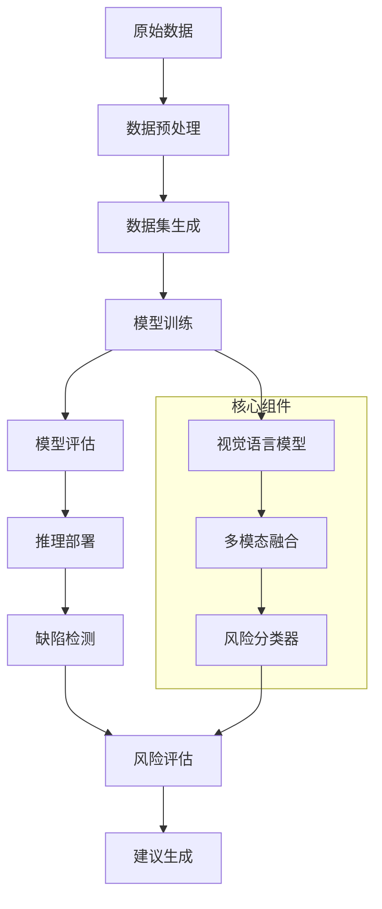

<div align="center">


# RisKVA - Risk Assessment VLM Assistant

**基于视觉语言模型(VLM)的智能风险评估助手，专注于工程缺陷检测和风险等级评估**

[](https://python.org)
[](https://pytorch.org)
[](LICENSE)
[]()

[🚀 快速开始](#🚀-快速开始) • [📊 数据集](#🗂️-数据集) • [🛠️ 安装使用](#🛠️-安装与使用) • [🏗️ 系统架构](#🏗️-系统架构) • [📝 开发路线图](#📝-开发路线图与待办事项)

---

</div>

## 📋 项目概述

RisKVA 是一个基于视觉语言模型的智能风险评估系统，专门用于建筑工程缺陷检测和风险等级评估。项目致力于通过先进的多模态AI技术，自动化识别建筑工程中的质量缺陷，并提供专业的风险评估和整改建议。

### 项目目的
- 自动化建筑缺陷识别与风险评估，提高质检效率
- 统一评估标准，降低人工主观性
- 生成针对性建议，为工程管理提供决策依据

### 核心能力
- 多模态缺陷识别、风险分级与整改建议一体化
- 批量推理、报告生成与 LangGraph 数据分析
- 统一 API/CLI，适配训练、推理与数据清洗全流程

### 技术栈速览
- 模型与训练：PyTorch、Transformers、Qwen2.5-VL、DeepSpeed、PEFT
- 数据与服务：Datasets、Pandas、LangGraph、LangChain、LangSmith
- 前端与工具：Next.js、React、Tailwind CSS、TensorBoard、Weights & Biases

### 安装依赖步骤

1. **克隆项目**
```bash
git clone https://github.com/your-repo/RisKVA.git
cd RisKVA
```

2. **创建虚拟环境**
```bash
conda create -n riskva python=3.10
conda activate riskva
```

3. **安装依赖包**
```bash
pip install -r requirements.txt

# Flash Attention需要单独安装
pip install flash-attn --no-build-isolation -v
```

> ℹ️ **依赖说明**：包括 `src/dino_subunit_risk/` 在内的所有子模块现已统一使用根目录的 `requirements.txt`。若子模块历史文档提及单独的 `requirements.txt`，请以根依赖为准。

4. **下载预训练模型**
```bash
# 使用提供的脚本下载Qwen2.5-VL模型
cd models/pretrained_models
bash hfd.sh
```

### 配置文件

- **训练配置**: `configs/accelerate_configs/` - DeepSpeed和多GPU配置
- **提示词配置**: `configs/prompt_configs/subunit_risk_prompt.yaml` - 分户检查风险评估提示词模板
- **环境配置**: 复制`.env.example`到`.env`并配置相关路径

### 启动命令或运行步骤

#### 模型训练
```bash
# 7B模型训练
bash scripts/subunit_risk/train/qwen_7b.sh

# 3B模型评估
bash scripts/subunit_risk/eval/qwen_3b.sh

# 使用PEFT进行高效训练
bash scripts/subunit_risk/train/qwen_7b_lora.sh
```

#### 模型推理
```bash
# Python API调用
python src/sft_subunit_risk/inference.py \
    --model_path models/finetuned_models/RisKVA/RisKVA-Qwen2.5-VL-7B-Instruct-sft-subunit-risk \
    --image_path path/to/your/image.jpg \
    --output_format json
```

#### DINOv2 缺陷分类训练/评估

> 📌 `src/dino_subunit_risk/diinov2.py` 提供基于 DINOv2 backbone + MLP 分类头的缺陷分类能力，可作为轻量级表征器或快速验证基线。

```bash
# 仅训练分类头（默认冻结 backbone）
python src/dino_subunit_risk/diinov2.py \
    --model_name dinov2_vitg14 \
    --state_dict_path models/pretrained_models/dinov2/dinov2_vitg14_reg4_pretrain.pth \
    --csv_file datasets/Subunit-Risk_v3/metadata_with_image_filterbadcase.csv \
    --epochs 15 --batch_size 32

# 从 checkpoint 评估，支持 Pass@k 指标
python src/dino_subunit_risk/diinov2.py \
    --model_name dinov2_vitg14 \
    --state_dict_path models/pretrained_models/dinov2/dinov2_vitg14_reg4_pretrain.pth \
    --eval_from_checkpoint datasets/Subunit-Risk_v3/checkpoints/best_model.pth \
    --pass_k 3
```

**模块亮点**
- 通过 `--freeze_backbone` 控制是否解冻 DINOv2，方便做 LoRA/全参微调实验
- 自动解析 `metadata_with_image*.csv` 的多图路径字段，支持图像级别 sample 扩增
- 训练阶段内置准确率、Pass@k 与分类报告输出，便于快速观测缺陷类别学习情况
- 统一依赖根目录 `requirements.txt`，无需额外安装

#### 数据智能体启动

> 📚 **详细使用说明请参考**：[code/RisKVA/src/data_agent_risk/README.ipynb](src/data_agent_risk/README.ipynb)


```bash
# 进入数据智能体目录
cd src/data_agent_risk/data_agent

# 安装依赖
pip install -r requirements.txt

# 配置环境变量（复制.env.example到.env并配置）
cp .env.example .env

# 启动LangGraph服务
langgraph dev

# 启动Web聊天界面（新终端）
cd agent-chat-ui
pnpm install
pnpm dev
```

## 🗂️ 数据集

### 数据集来源
- **主要数据集**: Subunit-Risk 分户检查数据集
- **数据规模**: 3,771个图像-文本对
- **数据范围**: 建筑工程缺陷检测与风险评估
- **标注质量**: 专业工程师人工标注

### 数据集结构说明

```
datasets/RisKVA/Subunit-Risk_original/
├── images/                     # 缺陷图片目录
│   ├── 000000_00_SR-FH-1-20250611-000.jpg
│   ├── 000001_00_SR-FH-1-20250611-001.jpg
│   └── ...
├── metadata.csv               # 主要数据文件
├── metadata_with_image.csv    # 包含图片信息的元数据
└── dataset_info.json         # 数据集信息文件
```

**数据格式说明**:
- **图像格式**: JPG/PNG，主要尺寸 394x315
- **标签格式**: CSV文件包含以下字段：
  - `file_id`: 文件标识符
  - `defect_description_text`: 缺陷描述
  - `risk_detail`: 风险详情
  - `correction_suggestion`: 纠正建议
  - `risk_level_original`: 原始风险等级
  - `risk_level_current`: 当前风险等级
  - `image_count`: 图片数量
  - `all_image_paths`: 图片路径列表

### 使用自定义数据集的说明

1. **数据格式要求**
   - 图片格式: JPG/PNG/BMP
   - 元数据: CSV格式，包含必要字段
   - 目录结构: 参考现有数据集组织方式

2. **数据预处理工具**
```bash
# 使用数据预处理脚本
cd scripts/prepare_dataset

# Excel转CSV
python get_text.py -i /path/to/excel/files -o /path/to/csv/output

# 数据清理
python format_csv.py

# 生成数据集
python get_datasets.py
```

3. **数据验证**
```bash
# 检查数据集格式
python load_dataset_demo.py
```

## 🏗️ 系统架构

### 组件概述

RisKVA系统采用模块化设计，主要包含以下核心组件：

1. **数据预处理模块** (`scripts/prepare_dataset/`)
   - Excel数据转换
   - 图像格式标准化
   - 数据清理和验证
   - 数据集格式转换

2. **模型训练模块** (`src/sft_subunit_risk/train.py`)
   - 多模态数据加载
   - 模型微调训练
   - 内存优化管理
   - 分布式训练协调

3. **推理引擎** (`src/sft_subunit_risk/inference.py`)
   - 实时图像分析
   - 批量数据处理
   - 结果格式化输出
   - API接口封装

4. **模型评估** (`src/sft_subunit_risk/evaluation.py`)
   - 风险评估推理
   - 性能指标计算
   - 评估结果分析

5. **数据智能体模块** (`src/data_agent_risk/`)
   - LangGraph数据分析智能体
   - MySQL数据库查询工具
   - 数据可视化生成
   - Web聊天界面集成
   - Tavily搜索工具集成

6. **配置管理** (`configs/`)
   - 训练超参数配置
   - 加速器配置文件
   - 提示词模板管理
   - 环境变量配置

### 系统工作流程



### 技术架构特点

- **多模态融合**: 结合图像视觉特征和文本语义信息
- **端到端训练**: 从原始数据到最终预测的完整流程
- **模块化设计**: 各组件独立开发和维护
- **可扩展性**: 支持新的缺陷类型和评估标准
- **高性能优化**: 内存管理、梯度累积、混合精度训练

---

## 📁 项目结构

```
RisKVA/
├── src/                                # 源代码
│   ├── sft_subunit_risk/               # Qwen2.5-VL SFT/推理/评估
│   ├── dino_subunit_risk/              # DINOv2 缺陷分类基线
│   │   ├── diinov2.py                  # 训练 & 评估脚本
│   │   └── dinov2/                     # 引入的 DINOv2 源码
│   ├── data_agent_risk/                # LangGraph 数据智能体
│   │   ├── data_agent/agent-chat-ui/   # Next.js Web 前端
│   │   └── README.ipynb                # 教程与说明
├── scripts/                            # 训练 & 数据处理脚本
│   └── subunit_risk/
│       ├── train/                      # 训练入口（如 qwen_7b.sh）
│       ├── eval/                       # 评估入口
│       └── prepare_dataset/            # Excel/CSV 预处理工具集
├── datasets/                           # 数据集
│   ├── Subunit-Risk_v1/…               # 历史版本
│   ├── Subunit-Risk_v2/…               # 对应 metadata_with_image.csv
│   ├── Subunit-Risk_v3/…               # 当前主用数据
│   └── other-datasets/                 # PR/SR/QILAN 等扩展
├── models/
│   ├── pretrained_models/              # Qwen2.5-VL、DINOv2 等权重
│   ├── finetuned_models/               # RisKVA 微调结果
│   └── checkpoints/                    # 中间断点
├── checkpoints/                        # DINOV2 等额外 checkpoint
├── configs/                            # 加速器/Prompt 配置
├── requirements.txt                    # 统一依赖
├── README.md                           # 项目说明
└── logo/                               # 项目标识资源
```

## 🚀 快速开始

1. **环境准备**: 参考安装指南设置环境
2. **数据准备**: 下载或准备训练数据
3. **模型训练**: 运行训练脚本
4. **模型推理**: 使用训练好的模型进行预测

## 📊 性能评估

- 支持多种评估指标
- 自动生成评估报告
- 与基准模型对比分析

## 🔧 配置说明

详细的配置选项请参考 `configs/` 目录下的相关文件。

## 🤝 贡献指南

欢迎提交Issue和Pull Request来改进项目。