<div align="center">


# RisKVA - Risk Assessment VLM Assistant

**基于视觉语言模型(VLM)的智能风险评估助手，专注于工程缺陷检测和风险等级评估**

[](https://python.org)
[](https://pytorch.org)
[](LICENSE)
[]()

[🚀 快速开始](#🚀-快速开始) • [📊 数据集](#🗂️-数据集) • [🛠️ 安装使用](#🛠️-安装与使用) • [🏗️ 系统架构](#🏗️-系统架构) • [📝 开发路线图](#📝-开发路线图与待办事项)

---

</div>

## 📋 项目概述

RisKVA 是一个基于视觉语言模型的智能风险评估系统，专门用于建筑工程缺陷检测和风险等级评估。项目致力于通过先进的多模态AI技术，自动化识别建筑工程中的质量缺陷，并提供专业的风险评估和整改建议。

### 项目目的
- 提高建筑工程质量检测的效率和准确性
- 标准化缺陷识别和风险评估流程
- 减少人工检测的主观性和遗漏风险
- 为工程质量管理提供智能化解决方案

### 主要功能
- **多模态缺陷识别**：结合图像和文本信息进行缺陷检测
- **智能风险评估**：自动评估缺陷的风险等级和影响程度
- **专业建议生成**：提供针对性的纠正和预防建议
- **批量处理能力**：支持大规模工程数据的自动化分析

### 技术栈概述
- **基础框架**：PyTorch, Transformers, TRL
- **核心模型**：Qwen2.5-VL系列视觉语言模型
- **训练加速**：DeepSpeed, PEFT (LoRA), Flash Attention
- **数据处理**：Datasets, Pandas, PIL
- **分布式训练**：Accelerate, 多GPU支持
- **监控工具**：TensorBoard, Weights & Biases

## ✨ 功能特性

### 核心功能模块

1. **缺陷识别与分类**
   - 多种建筑缺陷类型自动识别（渗水、开裂、脱落等）
   - 基于深度学习的图像特征提取
   - 支持复杂场景下的缺陷定位

2. **风险等级评估**
   - 五级风险分类体系（A-正常、B-轻微、C-中等、D-严重、E-严重质量行为风险）
   - 原始风险与当前风险状态对比
   - 基于行业标准的评估准则

3. **智能建议生成**
   - 个性化纠正措施建议
   - 预防性维护指导
   - 符合工程实践的专业建议

4. **模型训练与优化**
   - 支持3B、7B、32B等多种规模模型
   - PEFT技术实现高效微调
   - 内存优化和梯度检查点
   - 分布式训练支持

5. **推理引擎**
   - 实时图像分析
   - 批量数据处理
   - 多种输入格式支持
   - 灵活的部署选项

## 🛠️ 安装与使用

### 环境要求

- **硬件要求**
  - GPU: NVIDIA RTX 3090/4090 或更高 (推荐24GB+ 显存)
  - CPU: 8核心以上
  - 内存: 32GB以上
  - 存储: 100GB可用空间

- **软件环境**
  - Python 3.8+
  - CUDA 11.8+
  - Linux/Ubuntu (推荐)

### 安装依赖步骤

1. **克隆项目**
```bash
git clone https://github.com/your-repo/RisKVA.git
cd RisKVA
```

2. **创建虚拟环境**
```bash
conda create -n riskva python=3.10
conda activate riskva
```

3. **安装依赖包**
```bash
pip install -r requirements.txt

# Flash Attention需要单独安装
pip install flash-attn --no-build-isolation -v
```

4. **下载预训练模型**
```bash
# 使用提供的脚本下载Qwen2.5-VL模型
cd models/pretrained_models
bash hfd.sh
```

### 配置文件

- **训练配置**: `configs/accelerate_configs/` - DeepSpeed和多GPU配置
- **提示词配置**: `configs/prompt_configs/building_risk_prompts.yaml` - 风险检测提示词模板
- **环境配置**: 复制`.env.example`到`.env`并配置相关路径

### 启动命令或运行步骤

#### 模型训练
```bash
# 7B模型训练
bash scripts/RisKVA/train_subunit_risk_7b.sh

# 3B模型训练
bash scripts/RisKVA/train_subunit_risk_3b.sh

# 使用PEFT进行高效训练
bash scripts/RisKVA/train_subunit_risk_7b_peft.sh
```

#### 模型推理
```bash
# Python API调用
python src/sft_subnunit_risk/inference.py \
    --model_path models/finetuned_models/RisKVA/RisKVA-Qwen2.5-VL-7B-Instruct-sft-subunit-risk \
    --image_path path/to/your/image.jpg \
    --output_format json
```

## 🗂️ 数据集

### 数据集来源
- **主要数据集**: Subunit-Risk 分户检查数据集
- **数据规模**: 3,771个图像-文本对
- **数据范围**: 建筑工程缺陷检测与风险评估
- **标注质量**: 专业工程师人工标注

### 数据集结构说明

```
datasets/RisKVA/Subunit-Risk_original/
├── images/                     # 缺陷图片目录
│   ├── 000000_00_SR-FH-1-20250611-000.jpg
│   ├── 000001_00_SR-FH-1-20250611-001.jpg
│   └── ...
├── metadata.csv               # 主要数据文件
├── metadata_with_image.csv    # 包含图片信息的元数据
└── dataset_info.json         # 数据集信息文件
```

**数据格式说明**:
- **图像格式**: JPG/PNG，主要尺寸 394x315
- **标签格式**: CSV文件包含以下字段：
  - `file_id`: 文件标识符
  - `defect_description_text`: 缺陷描述
  - `risk_detail`: 风险详情
  - `correction_suggestion`: 纠正建议
  - `risk_level_original`: 原始风险等级
  - `risk_level_current`: 当前风险等级
  - `image_count`: 图片数量
  - `all_image_paths`: 图片路径列表

### 使用自定义数据集的说明

1. **数据格式要求**
   - 图片格式: JPG/PNG/BMP
   - 元数据: CSV格式，包含必要字段
   - 目录结构: 参考现有数据集组织方式

2. **数据预处理工具**
```bash
# 使用数据预处理脚本
cd scripts/prepare_dataset

# Excel转CSV
python get_text.py -i /path/to/excel/files -o /path/to/csv/output

# 数据清理
python format_csv.py

# 生成数据集
python get_datasets.py
```

3. **数据验证**
```bash
# 检查数据集格式
python load_dataset_demo.py
```

## 🏗️ 系统架构

### 组件概述

RisKVA系统采用模块化设计，主要包含以下核心组件：

1. **数据预处理模块** (`scripts/prepare_dataset/`)
   - Excel数据转换
   - 图像格式标准化
   - 数据清理和验证
   - 数据集格式转换

2. **模型训练模块** (`src/sft_subnunit_risk/train.py`)
   - 多模态数据加载
   - 模型微调训练
   - 内存优化管理
   - 分布式训练协调

3. **推理引擎** (`src/sft_subnunit_risk/inference.py`)
   - 实时图像分析
   - 批量数据处理
   - 结果格式化输出
   - API接口封装

4. **配置管理** (`configs/`)
   - 训练超参数配置
   - 加速器配置文件
   - 提示词模板管理
   - 环境变量配置

### 系统工作流程

```mermaid
graph TD
    A[原始数据] --> B[数据预处理]
    B --> C[数据集生成]
    C --> D[模型训练]
    D --> E[模型评估]
    E --> F[推理部署]
    F --> G[缺陷检测]
    G --> H[风险评估]
    H --> I[建议生成]
    
    subgraph "核心组件"
        J[视觉语言模型]
        K[多模态融合]
        L[风险分类器]
    end
    
    D --> J
    J --> K
    K --> L
    L --> H
```



### 技术架构特点

- **多模态融合**: 结合图像视觉特征和文本语义信息
- **端到端训练**: 从原始数据到最终预测的完整流程
- **模块化设计**: 各组件独立开发和维护
- **可扩展性**: 支持新的缺陷类型和评估标准
- **高性能优化**: 内存管理、梯度累积、混合精度训练

---

## 📁 项目结构

```
RisKVA/
├── src/                           # 源代码目录
│   └── sft_subunit_risk/         # 分户风险评估模块
│       ├── train.py               # 模型训练脚本
│       └── inference.py           # 推理脚本
├── scripts/                       # 脚本工具
│   ├── prepare_dataset/           # 数据预处理工具
│   └── RisKVA/                    # 训练脚本
├── datasets/                      # 数据集目录
│   └── RisKVA/                    # RisKVA专用数据集
├── models/                        # 模型相关文件
│   ├── pretrained_models/         # 预训练模型
│   └── finetuned_models/          # 微调后模型
├── configs/                       # 配置文件
│   ├── accelerate_configs/        # 加速器配置
│   └── prompt_configs/            # 提示词配置
├── experiments/                   # 实验记录
├── logs/                         # 训练日志
├── requirements.txt              # 依赖配置
└── README.md                     # 项目说明
```

## 🚀 快速开始

1. **环境准备**: 参考安装指南设置环境
2. **数据准备**: 下载或准备训练数据
3. **模型训练**: 运行训练脚本
4. **模型推理**: 使用训练好的模型进行预测

## 📊 性能评估

- 支持多种评估指标
- 自动生成评估报告
- 与基准模型对比分析

## 🔧 配置说明

详细的配置选项请参考 `configs/` 目录下的相关文件。

## 📝 开发路线图与待办事项

### 🎯 当前版本目标 (v1.0)
- [x] ✅ 基础VLM训练框架搭建
- [x] ✅ Subunit-Risk数据集集成
- [x] ✅ Qwen2.5-VL模型适配
- [x] ✅ 多GPU训练优化
- [x] ✅ 优化显存和内存的垃圾处理
- [x] ✅ 使用flashattention优化训练性能
- [x] ✅ 完善prompt
- [ ] 📋 图像增强处理
- [ ] 📋 训练32B模型

### 🚀 下一版本规划 (v1.1)
- [ ] 📋 GRPO训练代码框架
- [ ] 📋 使用ligerloss优化训练性能
- [ ] 📋 Web界面开发
- [ ] 📋 批量推理性能提升

### 🔧 技术债务
- [ ] 📋 代码重构：训练流程模块化
- [ ] 📋 文档完善：API文档生成
- [ ] 📋 测试覆盖：单元测试添加
- [ ] 📋 配置管理：环境变量统一

### 📊 性能优化任务
- [ ] 📋 内存使用优化
- [ ] 📋 训练速度提升
- [ ] 📋 推理延迟降低
- [ ] 📋 模型精度改进

> 💡 **任务状态说明：** ✅ 已完成 | 🔄 进行中 | 📋 待开始

## 🤝 贡献指南

欢迎提交Issue和Pull Request来改进项目。